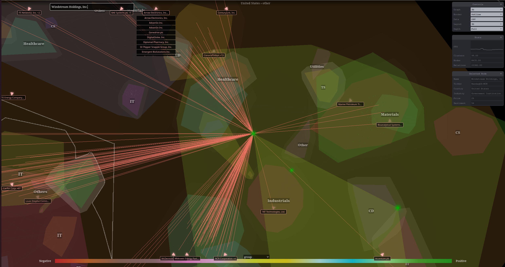
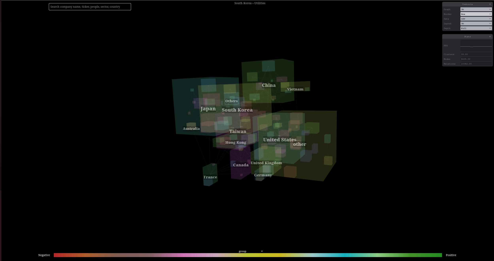

# cluster-graph-3d

A 3D force-directed graph component using ThreeJS/WebGL. Renders large graphs (50k+ nodes, 200k+ edges) in 3D with force-simulation layout, sub-clustering, convex hull grouping, and post-processing effects.

| Clamped offscreen node navigation | Full graph with box hull clusters |
|---|---|
|  |  |

## Install

```bash
npm install cluster-graph-3d
```

Peer dependencies you must also install:

```bash
npm install lodash
```

## Quick Start

```js
import GraphView3D from 'cluster-graph-3d/graph'
import Default3DGraphConfig from 'cluster-graph-3d/config'

const container = document.getElementById('graph')

const graph = new GraphView3D(container)
const config = new Default3DGraphConfig(graph)

graph.setSpeccs(config.getSpeccs())

graph.setData({
  nodes: {
    '1': { id: '1', name: 'Alice', group: 'A' },
    '2': { id: '2', name: 'Bob',   group: 'A' },
    '3': { id: '3', name: 'Carol', group: 'B' },
  },
  links: [
    { source: '1', target: '2' },
    { source: '2', target: '3' },
  ]
})
```

```html
<div id="graph" style="width: 100vw; height: 100vh;"></div>
```

## Load from CSV

```js
import GraphView3D from 'cluster-graph-3d/graph'
import Default3DGraphConfig from 'cluster-graph-3d/config'

const graph = new GraphView3D(document.getElementById('graph'))
const config = new Default3DGraphConfig(graph)
graph.setSpeccs(config.getSpeccs())

graph.loadDatasource(new CsvDatasource('nodes.csv', 'edges.csv'))
```

CSV format — nodes:

```
id,name,group,industry
1,Alice,GroupA,Tech
2,Bob,GroupA,Tech
3,Carol,GroupB,Finance
```

CSV format — edges:

```
SourceID,TargetID,Relationship Strenght
1,2,0.8
2,3,0.5
```


## API

### `new GraphView3D(domElement)`

| Method | Description |
|---|---|
| `setData(graphData)` | Load graph from a plain object `{ nodes: {}, links: [] }` |
| `loadDatasource(datasource)` | Load graph from a `Datasource` instance (replaces current graph) |
| `loadDataSet(fn)` | Load graph via a callback `fn(null, onSuccess)` |
| `setSpeccs(speccs)` | Set clustering/layout configuration from `Default3DGraphConfig` |
| `setTextVisible(bool)` | Show or hide node text labels |
| `resizeCanvas()` | Trigger a canvas resize manually |
| `start()` / `stop()` | Start or stop the render loop |

Inherited from `View3D`:

| Method | Description |
|---|---|
| `set2D()` / `set3D()` | Switch between orthographic and perspective camera |
| `add(object3D)` | Add a raw Three.js object to the scene |
| `maximise()` / `undoMaximise()` | Expand/collapse the canvas within its container |

| `scene()` | Access the internal `THREE.Scene` |
| `camera()` | Access the internal camera |
| `renderer()` | Access the internal `WebGLRenderer` |

### `new Default3DGraphConfig(graphView, backgroundColor?, cssClass?)`

| Method | Description |
|---|---|
| `getSpeccs()` | Returns the clustering spec array to pass to `graph.setSpeccs()` |
| `setMode(onComplete?)` | Switch layout mode |
| `doZoomToRelevant()` | Zoom camera to the relevant portion of the graph |
| `zoomToPosition(position, onComplete)` | Animate camera to a `THREE.Vector3` position |
| `restartGraph()` | Re-run the force simulation from scratch |

## Data Format

```js
{
  nodes: {
    'id1': { id: 'id1', name: 'Node 1', group: 'GroupA', industry: 'Tech', color: 0xff0000 },
    'id2': { id: 'id2', name: 'Node 2', group: 'GroupB' },
  },
  links: [
    { source: 'id1', target: 'id2', strength: 0.5 }
  ]
}
```

| Field | Description |
|---|---|
| `id` | Unique node identifier (string) |
| `name` | Display label |
| `group` | Primary clustering key |
| `industry` | Secondary clustering key |
| `color` | Hex color (optional) |
| `source` / `target` | Node ids for links |
| `strength` | Link weight (optional, `0`–`1`) |

## Build

```bash
# dev server
npm run dev

# build the app (vite)
npm run build:app

# build the library for publishing (tsup)
npm run build:lib
```

## License

Proprietary — see `LICENSE.md`.
